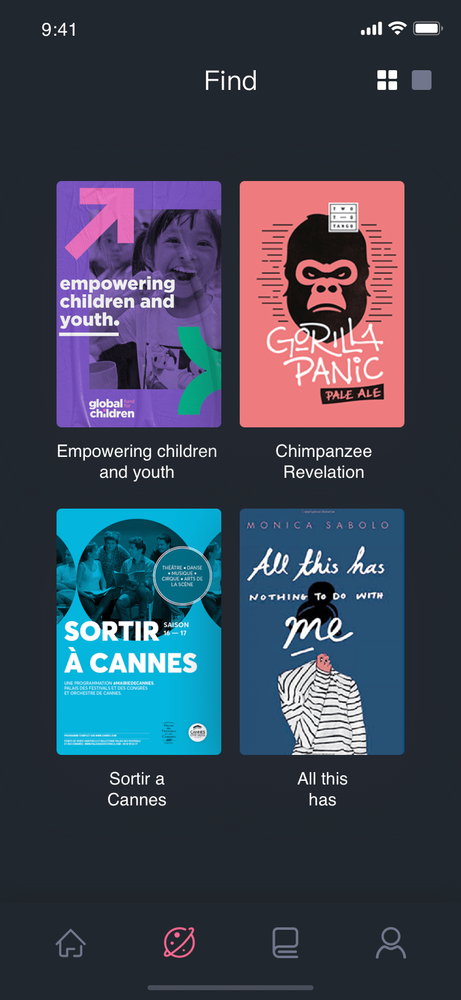
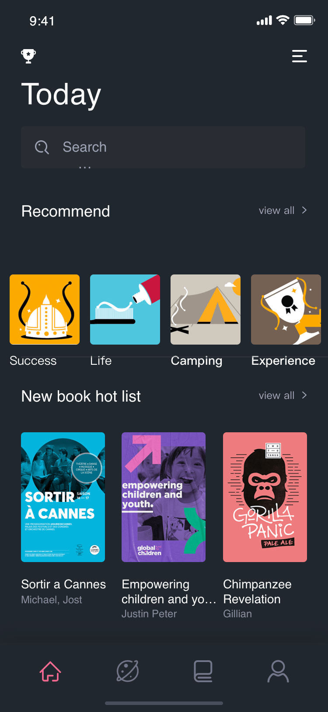
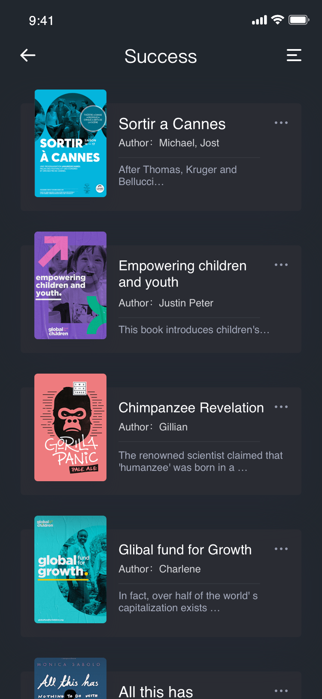

<h1 align="center">Flutter book App</h1>

## 预览图

<p align="center">
    
    
    
</p>

## 安卓IOS预览
<p align="center">
    
    
</p>

### 依赖库

```dart
environment:
  sdk: ">=2.1.0 <3.0.0"
dependencies:
  flutter:
    sdk: flutter
  mobx:
  flutter_mobx: // Mobx
  cupertino_icons: ^0.1.2
  flutter_svg: ">=0.12.4" // 处理SVG图片
  carousel_slider: ^1.3.0 // 轮播图
  fluro: "^1.4.0" // 路由
  provider: ^2.0.1 // 用于包裹mobx

dev_dependencies:
  flutter_test:
    sdk: flutter
  build_runner: ^1.3.1 //Mobx依赖
  mobx_codegen: // Mobx依赖
```

## Mobx

```dart
flutter packages pub run build_runner build
flutter packages pub run build_runner watch
flutter packages pub run build_runner watch --delete-conflicting-outputs
```

## 运行

Run `flutter packages pub run build_runner build`构建`mobx`，成功以后启动`mobx`监听

Run `flutter packages pub run build_runner watch`，在你修改了`store`以后会自动刷新。

## 开始

This project is a starting point for a Flutter application.

A few resources to get you started if this is your first Flutter project:

- [Lab: Write your first Flutter app](https://flutter.io/docs/get-started/codelab)
- [Cookbook: Useful Flutter samples](https://flutter.io/docs/cookbook)

For help getting started with Flutter, view our 
[online documentation](https://flutter.io/docs), which offers tutorials, 
samples, guidance on mobile development, and a full API reference.
