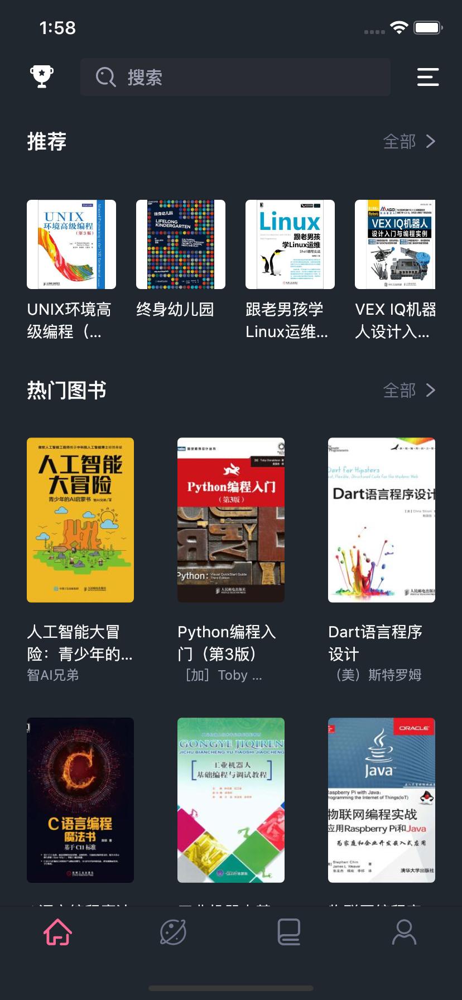

<h1 align="center">Flutter book App</h1>
<h2 align="center">使用Flutter 1.17.x，如果不能运行请检查你的Flutter版本</h2>

#### 后端使用[GoLang+Mysql](https://github.com/Tecode/golang_api)

## 安卓APK下载
<p align="center">
    
</p>

## 安卓IOS预览
<p align="center">
    
    
</p>

## 预览图

<p align="center">
    
    
    
    
    
    
    
    
    
    
</p>


## 依赖库

```dart
dependencies:
  flutter:
    sdk: flutter
  mobx: 1.2.0
  flutter_mobx: 1.1.0
  shared_preferences: 0.5.3+4
  url_launcher: 5.1.2
  webview_flutter: 0.3.21
  image_cropper: 1.0.2
  image_picker: 0.6.1+4


  # The following adds the Cupertino Icons font to your application.
  # Use with the CupertinoIcons class for iOS style icons.
  cupertino_icons: ^0.1.2
  flutter_svg: 0.17.4
  carousel_slider: 2.1.0
  fluro: 1.6.3
  provider: 4.1.2
  dio: 3.0.9
  photo_view: 0.9.2
  json_annotation: 3.0.1

dev_dependencies:
  flutter_test:
    sdk: flutter
  build_runner: 1.10.0
  mobx_codegen: 1.1.0
  json_serializable: 3.3.0
  flutter_easyrefresh: 2.0.4
```

## `Flutter`版本

```bash
Flutter 1.17.1 • channel stable • https://github.com/flutter/flutter.git
Framework • revision f7a6a7906b (3 days ago) • 2020-05-12 18:39:00 -0700
Engine • revision 6bc433c6b6
Tools • Dart 2.8.2
```

## `Mobx`和`JSON`序列化构建

```dart
flutter packages pub run build_runner build
flutter packages pub run build_runner watch
flutter packages pub run build_runner watch --delete-conflicting-outputs
flutter packages pub run build_runner clean
```

## 运行

Run `flutter packages pub run build_runner build`构建`mobx`，成功以后启动`mobx`监听

Run `flutter packages pub run build_runner watch`，在你修改了`store`以后会自动刷新。

## `Mobx`踩坑

获取`store`的方法是`build`方法使用`Provider.of<HomeStore>(context)`可以得到对应的`store`,这样虽然我们可以得到`store`但是在`build`方法里面会导致我们在页面跳转的时候或者切换页面的时候执行重新请求数据，我们想要的不是这个，而是下拉刷新来获取新的数据。如果在`build`里面发送请求会出现的用户滑动到某个位置回来以后数据重新请求导致重新构建。查看`performance`控制台你会发现内部的组件在疯狂的`rebuild`,为了数据能够共享还是在`initState`去发送请求，具体代码如下：

```dart
  @override
  void initState() {
    // TODO: implement initState
    super.initState();
    Future.delayed(Duration.zero, () {
      // 获取对应的store
      homeStore = Provider.of<HomeStore>(this.context, listen: false);
      // 发送请求
      homeStore.getData();
    });
  }
```

## 错误信息

### 我使用安卓8.0解决了这个问题

```bash
Error connecting to the service protocol: HttpException: Connection closed before full header was received, uri = http://127.0.0.1:50626/DWu3_eY6i8s=/ws
```

### 配置key.properties

错误原因：由于配置了安卓发布的秘钥提交的时候忽略了，需要自行去配置。

错误信息

```bash
* What went wrong:
A problem occurred evaluating project ':app'.
> D:\project\flutter_book\android\key.properties
```


在`<app dir>/android/`目录下，创建一个`key.properties`文件`<app dir>`代表工程的根目录,在`key.properties`写入

复制粘贴即可，如果需要打包发布`APP`需要配置以下信息，而且要生成`key.jks`文件,这里只是让项目可以运行，如果需要发布详细请看[https://flutter.dev/docs/deployment/android](https://flutter.dev/docs/deployment/android)。

```bash
storePassword=<password from previous step>
keyPassword=<password from previous step>
keyAlias=key
storeFile=<location of the key store file, e.g. /Users/<user name>/key.jks>
```

```
storePassword    keystore 密码
keyPassword      key密码
keyAlias         key别名
storeFile        .jks文件路径
```

### 解决正式版发布不能联网问题

修改`android/app/src/main/AndroidManifest.xml`,新增以下权限

```bash
<uses-permission android:name="android.permission.READ_PHONE_STATE" />
<uses-permission android:name="android.permission.INTERNET" />
<uses-permission android:name="android.permission.ACCESS_NETWORK_STATE" />
<uses-permission android:name="android.permission.ACCESS_WIFI_STATE" />
<uses-permission android:name="android.permission.INTERNET"/>
```

### 微信SDK配置

#### android/build.gradle

```bash
buildscript {
    ext.kotlin_version = '1.3.31'
    repositories {
        google()
        jcenter()
    }

    dependencies {
        classpath 'com.android.tools.build:gradle:3.5.0'
        classpath "org.jetbrains.kotlin:kotlin-gradle-plugin:$kotlin_version"
    }
}
```
```
android/gradle/wrapper/gradle-wrapper.properties
```
