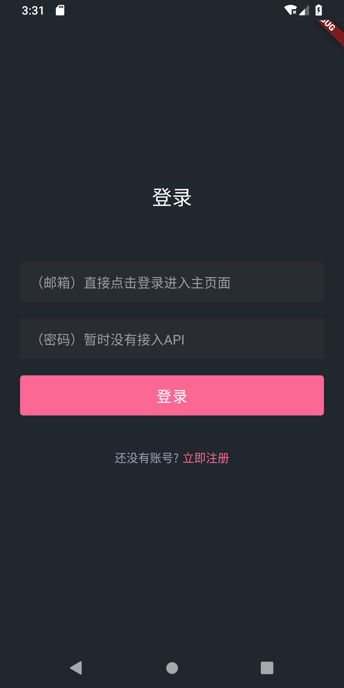

<h1 align="center">Flutter book App</h1>
<h2 align="center">使用Flutter 1.7.8+hotfix.3，如果不能运行请检查你的Flutter版本</h2>

## 预览图

<p align="center">
    
    
    
    
    
    
    
</p>

## 安卓IOS预览
<p align="center">
    
    
</p>

## 已经实现的功能

- 图片延时加载
- 大图缩放浏览
- 启动页
- 下拉刷新
- 路由跳转

## 依赖库

```dart
dependencies:
  flutter:
    sdk: flutter
  mobx: ^0.3.3+2
  flutter_mobx: ^0.3.0+1


  # The following adds the Cupertino Icons font to your application.
  # Use with the CupertinoIcons class for iOS style icons.
  cupertino_icons: ^0.1.2
  flutter_svg: ">=0.12.4"
  carousel_slider: ^1.3.0
  fluro: "^1.4.0"
  provider: ^2.0.1
  dio: 2.1.0
  photo_view: 0.4.2
  json_annotation: ^2.0.0

dev_dependencies:
  flutter_test:
    sdk: flutter
  build_runner: ^1.6.1
  mobx_codegen: ^0.3.3+1
  json_serializable: ^3.0.0
```

## `Flutter`版本

### `Ubuntu18`

```bash
Flutter 1.7.8+hotfix.3 • channel master • https://github.com/flutter/flutter.git
Framework • revision b76a1e8312 (11 days ago) • 2019-05-13 09:06:30 +0100
Engine • revision 816d3fc586
Tools • Dart 2.3.1 (build 2.3.1-dev.0.0 a0290f823c)
```

### `Windows10`

```bash
Flutter 1.7.8+hotfix.3 • channel stable • https://github.com/flutter/flutter.git
Framework • revision b593f5167b (5 weeks ago) • 2019-04-22 07:51:33 -0700
Engine • revision ca31a7c57b
Tools • Dart 2.3.0 (build 2.3.0-dev.0.1 cf4444b803)
```

## `MacOS`

```bash
Flutter 1.7.8+hotfix.4 • channel stable • https://github.com/flutter/flutter.git
Framework • revision 2e540931f7 (3 days ago) • 2019-07-09 13:14:38 -0700
Engine • revision 54ad777fd2
Tools • Dart 2.4.0
```

## `Mobx`和`JSON`序列化构建

```dart
flutter packages pub run build_runner build
flutter packages pub run build_runner watch
flutter packages pub run build_runner watch --delete-conflicting-outputs
flutter packages pub run build_runner clean
```

## 运行

Run `flutter packages pub run build_runner build`构建`mobx`，成功以后启动`mobx`监听

Run `flutter packages pub run build_runner watch`，在你修改了`store`以后会自动刷新。

## 错误信息

### 我使用安卓8.0解决了这个问题

```bash
Error connecting to the service protocol: HttpException: Connection closed before full header was received, uri = http://127.0.0.1:50626/DWu3_eY6i8s=/ws
```

